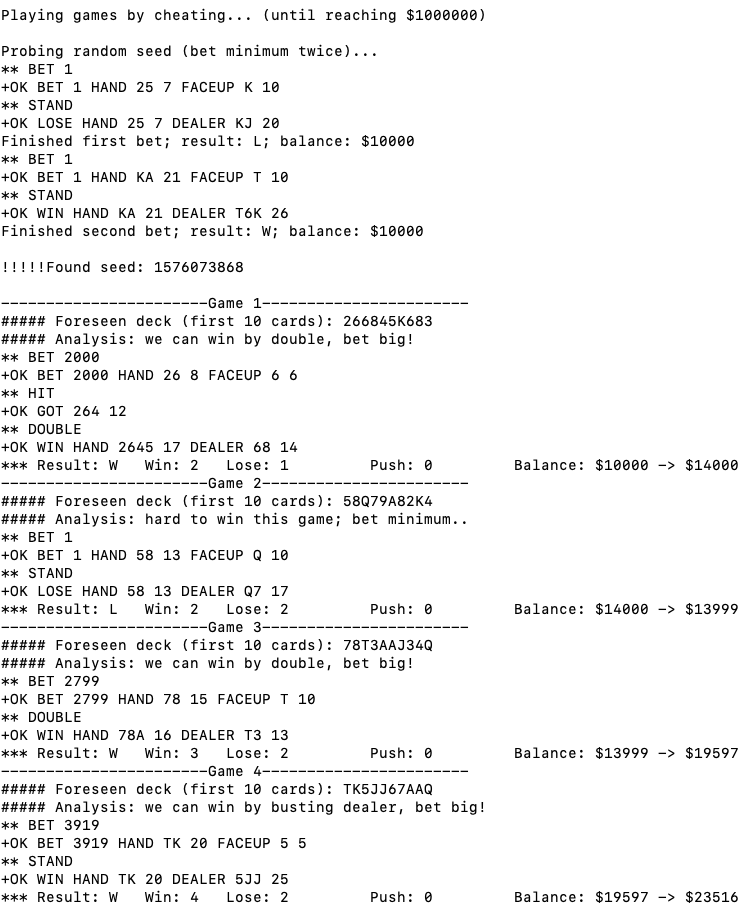

# Beating Blackjack

A fun lab exploiting randomness to bring down the house!

Our intelligent client can guess the card deck and play optimally. The server side code is adapted from: [adversary.io](https://platform.adversary.io/missions/seccourse-random/blackjack)

#### Start Server (under server directory):

`make`

`tcpserver -c100 -DPHRv -t60 0 5555 ./blackjack [username]`

Example:

`tcpserver -c100 -DPHRv -t60 0 5555 ./blackjack` (create or use default user)

`tcpserver -c100 -DPHRv -t60 0 5555 ./blackjack acidburn` (create or use acidburn)

New user's balance is set to $10000.

#### Play Manually:

`telnet localhost 5555`

Command example:
* BET 100: bet $100 and start a game
* HIT
* STAND
* DOUBLE
* HAND: show current hand value
* FACEUP: show dealer's face-up card value
* BALANCE: check current balance
* QUIT: quit the game

#### Play Automatically (under client directory):

`make`

`./client`

##### Sample Running Log
