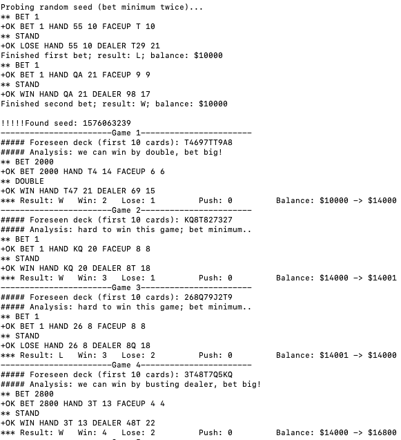

# Beating Blackjack

A fun lab exploiting randomness to bring down the house!

The server side code is from: [Adversary.io](https://platform.adversary.io/missions/seccourse-random/blackjack)

####Start Server (under server directory):

`make`

`tcpserver -c100 -DPHRv -t60 0 5555 ./blackjack`

####Play Manually:

`telnet localhost 5555`

####Play Automatically (under client directory):

`make`

`./client`

#####Sample Running Log
